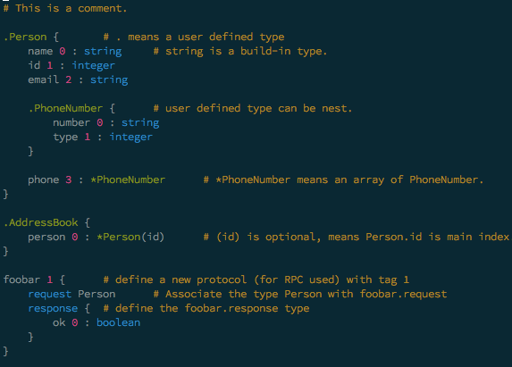

sproto-mode
===============

> Emacs major mode for editing [sproto](https://github.com/cloudwu/sproto)



How to Install
--------------

Put `sproto-mode.el` in Emacs load-path, and add this line to your .emacs file:

```lisp
(require 'sproto-mode)
(add-to-list 'auto-mode-alist '("\\.sproto\\'" . sproto-mode))
```
